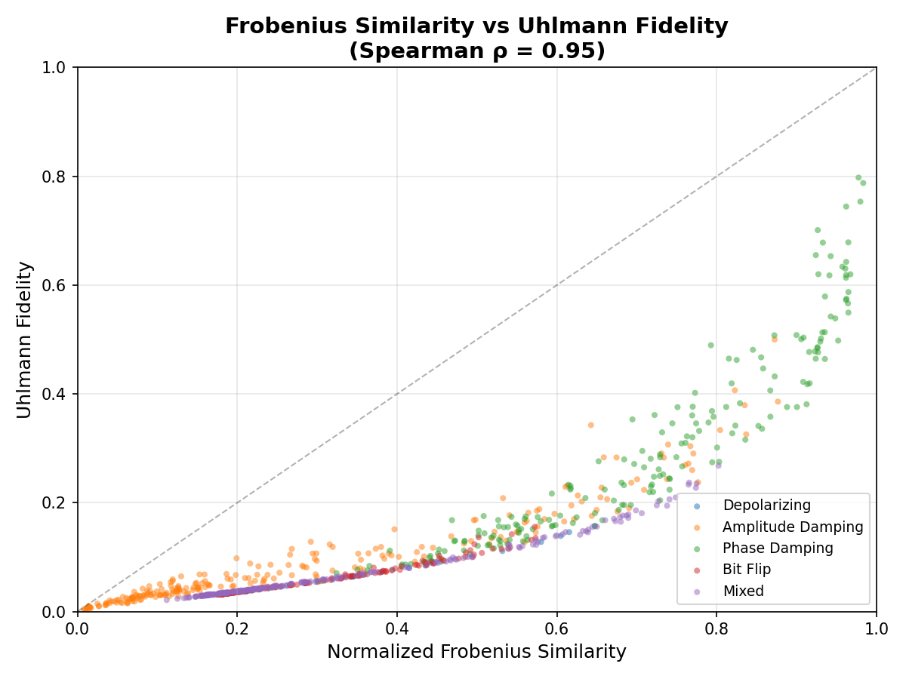

 #+OPTIONS: toc:nil
#+LATEX_CLASS_OPTIONS: [a4paper, 11pt, colorlinks=true, citecolor=., linkcolor=black, urlcolor=black]
#+LATEX_HEADER: \usepackage{fourier}
#+LATEX_HEADER: \usepackage{tikz}
#+LATEX_HEADER: \usepackage[style=authoryear, maxcitenames=1, maxbibnames=3]{biblatex}
#+LATEX_HEADER: \usepackage{subcaption}
#+LATEX_HEADER: \addbibresource{references.bib}
#+BIBLIOGRAPHY:references.bib
#+CITE_EXPORT: biblatex authoryear
#+BIND: org-cite-global-bibliography nil
#+AUTHOR: Amitav Krishna
#+TITLE: Comparing Machine Learning Strategies for Quantum Noise Reduction
* Abstract
Denoising entangled quantum states requires modeling global correlations across density matrices, yet it remains unclear whether architectural inductive biases or raw model capacity drive performance. We compare convolutional and transformer autoencoders on synthetic density-matrix denoising across 20 noise settings, using Uhlmann fidelity to measure reconstruction quality. Our central finding is that a compact transformer (119k parameters) achieves 0.95 Uhlmann fidelity while a CNN with 6.3× more parameters (749k) reaches only 0.30—a 3.2× performance advantage despite a substantial parameter disadvantage. This result demonstrates that architectural inductive bias dominates capacity for this task: the transformer's global attention mechanism, not its parameter count, enables high-fidelity reconstruction. The transformer's advantage holds across all noise types and levels, with consistent improvements over baseline ranging from +0.7 to +0.9 fidelity points depending on the corruption severity. These results establish that attention-based architectures offer substantial advantages for quantum state denoising due to their ability to model the non-local correlations characteristic of entangled states.
* Introduction
Prior work has explored convolutional architectures for quantum state denoising, leveraging locally structured patterns induced by density-matrix representations to mitigate the effects of decoherence without assuming explicit knowledge of the underlying hardware noise channel [cite:@kendre2025machinelearningquantumnoise]. Earlier approaches employ feedforward neural networks to reconstruct states corrupted by unknown dynamics, demonstrating that supervised neural models can learn effective, data-driven mappings from noisy to cleaner quantum states [cite:@Morgillo_2024].

Beyond state-level denoising, machine learning has been widely applied to quantum error correction and control. Classical convolutional decoders and multilayer perceptron models have been trained on local stabilizer syndrome neighborhoods, but this approach limits scalability and often necessitates retraining when code distances change. Transformer-based QEC decoders address this limitation by processing stabilizer syndromes globally, enabling access to long-range correlations and improved generalization across code parameters [cite:@wang2023transformerqecquantumerrorcorrection]. Related work applies reinforcement learning and optimal control networks to closed-loop quantum control tasks, targeting robustness at the hardware and pulse levels rather than direct state reconstruction [cite:@Ma_2025].

At a higher level, approaches to managing hardware noise broadly fall into quantum error correction (QEC) and quantum error mitigation (QEM). QEC provides a principled route to fault-tolerant computation by encoding logical information into larger composite systems and continuously detecting and correcting physical errors, with threshold theorems guaranteeing scalability in the asymptotic regime [cite:@Bravyi_2024; @202509.2149]. However, current devices remain far above these thresholds, and the overhead associated with large code distances and real-time decoding limits near-term applicability.

QEM instead targets near-term hardware by reducing the impact of noise through circuit-level extrapolation, classical inference, and statistical post-processing, typically focusing on recovering accurate expectation values rather than full quantum states [cite:@RevModPhys.95.045005; @Bultrini_2023]. While QEM does not offer scalability guarantees and incurs rapidly growing costs with circuit depth, it remains a primary tool for extracting useful results from noisy intermediate-scale quantum devices [cite:@filippov2024scalabilityquantumerrormitigation].

In contrast to syndrome decoding and observable-level mitigation, this work focuses specifically on *state-level denoising of density matrices*. Within this setting, a key question remains unresolved: whether models with structured global receptive fields, such as transformers, offer systematic advantages when denoising entangled quantum states. Existing methods rely primarily on convolutional architectures or unstructured fully connected networks, leaving this question unanswered. We investigate through a controlled comparison of convolutional and transformer autoencoders trained on identical synthetic datasets spanning multiple noise channels. Our results reveal that a compact transformer with one-sixth the parameters of a CNN achieves more than three times the reconstruction fidelity, demonstrating that architectural inductive bias—specifically, the transformer's native ability to model global correlations—dominates raw capacity for this task.
*** Notes :noexport:
**** Kendre                                                        :noexport:
CNN autoencoder for quantum noise reduction. Converting a noisy density matrix to its clean representation. Cirq. 5 qubit circuits.
**** Wang et al., transformer-QEC                                  :noexport:
High error rates in quantum devices hamper useful algorithm execution. QEC mitigates error rates with redundancy, distributing quantum information across multiple *data qubits* and utilizing *syndrome qubits* to monitor their states for errors. Syndromes are decoded to identify and correct errors in the *data qubits*. MLPs and CNNs have been proposed, but they focus on /local/ syndrome regions and require /retraining/ when adjusting for different code distances. They introduce a transformer-based QEC decoder, *Transformer-QEC*, which employs self-attention to achieve a global receptive field across all input syndromes. It uses local physical error and global parity label losses.
**** Halian Ma Machine Learning for Estimation and Control of quantum systems :noexport:
Machine learning have been used for different quantum quantum tasks. This paper discusses neural networks-based learning for optimal control of quantum systems, machine learning for quantum rrobust control, and reinforcement learning for quantum control. *Review paper*.
**** Morgillo et al.                                               :noexport:
Using feedforward neural networks to reconstruct and classify quantum states corrupted by an *unknown* noise channel.
**** Neural-network QST Hradil et al.                              :noexport:
Positivity constrained feed-forward neural networks convert outputs to valid quantum states. Like our constraints but hard instead of soft.
**** QEC w/ quantum autoencoders Locher et al.                     :noexport:
Quantum machine learning for quantum error correction in a quantum memory. How quantum autoencoders can be trained to learn optimal streategies for active detection and correction of errors, including spatially correlated computational errors as well as qubit losses. 

* Related work
Recent work has explored convolutional autoencoders for density-matrix denoising. Kendre et al. introduced a CNN-based approach that treats the density matrix as a two-channel image and applies standard encoder-decoder convolutions to map noisy states to clean reconstructions [cite:@kendre2025machinelearningquantumnoise]. This architecture exploits local spatial correlations, but its inductive bias makes modeling global correlations across the full matrix inefficient. Morgillo et al. used feedforward networks for states corrupted by unknown noise channels, demonstrating model-agnostic denoising, but without examining how architectural inductive biases affect performance on entangled states or comparing architectures with different global context mechanisms. Neither approach has been systematically compared to architectures capable of modeling non-local structure in entangled quantum states.

A related line of work enforces physical validity through hard constraints in quantum state reconstruction. Koutny et al. proposed positivity-constrained feedforward networks that project outputs onto the space of valid quantum states, guaranteeing Hermiticity and positive semidefiniteness by construction [cite:@PhysRevA.106.012409]. While effective for tomography, this approach does not address whether the network itself learns representations suited to quantum structure, nor how constraint enforcement interacts with denoising performance when constraints are enforced approximately rather than exactly.

Transformer architectures have been explored for related quantum tasks but not for density-matrix denoising. Wang et al. introduced Transformer-QEC for syndrome decoding in quantum error correction, demonstrating that self-attention enables global receptive fields that outperform local CNN decoders for quantum error-decoding tasks requiring access to correlations across the full syndrome [cite:@wang2023transformerqecquantumerrorcorrection]. Their work motivates our hypothesis that attention mechanisms may similarly benefit density-matrix reconstruction, where global correlations are fundamental.

No prior work has directly compared convolutional and attention-based architectures for density-matrix denoising under controlled conditions. Our experiments address this gap.
* Methods
** Dataset 
All experiments use 5-qubit quantum states, each represented as a 32 $\times$ 32 density matrix since the Hilbert space of an /n/-qubit system has dimension \(2^n\). Clean states are generated by sampling random quantum circuits with depths uniformly drawn from 6 to 9 layers. Each layer applies (i) a single-qubit gate chosen uniformly from \(\{X, Y, Z, H, T, S, R_x(\theta), R_y(\theta), R_z(\theta)\}\) with \(\theta \sim \mathcal{U}(0, 2\pi)\), followed by (ii) two randomly selected adjacent two-qubit gates from \(\{CNOT, CZ, SWAP\}\). This produces moderately deep circuits with nontrivial entanglement structure.

Noise is injected by applying a stochastic noise channel after every moment of the circuit. We evaluate five noise types: depolarizing, amplitude damping, phase damping, bit-flip, and a mixed channel. Each noise channel is implemented as a Cirq[cite:@CirqDevelopers_2025] noise operation applied independently to every qubit at each moment, with strength /p/ \(\in {0.05, 0.10, 0.15, 0.20}\). All simulations use Cirq's double-precision (=dtype=np.complex128=). The mixed noise channel is a sequential composition of depolarizing, amplitude-damping, phase-damping, and bit-flip channels, each applied with strength /p/ /4. Clean states \(\rho_{clean}\) are obtained by simulating the noiseless circuit using Cirq's =DensityMatrixSimulator=, and noisy states \(\rho_{noisy}\) are obtained by re-simulating the same circuit with noise inserted at every moment.

The dataset was originally generated with one million (\(\rho_{clean}, \rho_{noisy}\)) pairs (50,000 samples for each of the 20 noise-type / noise-level combinations). For computational efficiency, we use a uniformly subsampled subset of 100,000 examples in all experiments. The subsampling is stratified across noise types and noise levels, preserving the exact per-cell distribution of the original dataset. As a result, the subsampled dataset preserves the same marginal distributions over noise types and noise levels as the full one-million-sample dataset, and all reported results reflect this underlying data distribution. Each density matrix is stored in a two-channel real/imaginary representation suitable for neural-network processing.

The noise channels follow their standard Kraus-operator definitions[cite:@nielsen_chuang_2010]. For depolarizing noise,

$$
\mathcal{E}_{dep}(\rho) = (1-p)\rho + \frac{p}{3}(X \rho X + Y \rho Y + Z \rho Z)
$$
Amplitude damping uses

$$
K_0 = \begin{pmatrix}
1 & 0\\
0 & \sqrt{1-p}
\end{pmatrix}, 
 K_1 = \begin{pmatrix}
0 & \sqrt{p}\\
0 & 0
\end{pmatrix}
$$
Phase damping applies

$$
K_0 = \begin{pmatrix}
1 & 0\\
0 & \sqrt{1-p}
\end{pmatrix},
K_1 = \begin{pmatrix}
0 & 0\\
0 & \sqrt{p}
\end{pmatrix}
$$

which models pure dephasing (T_\phi), causing loss of off-diagonal coherence without energy exchange.
Bit flip noise is

$$
\mathcal{E}_{bf}(\rho) = (1-p)\rho + p X \rho X.
$$

As previously stated, the mixed channel applies these four channels sequentially, each with strength /p/ /4. This mixed channel is not intended to correspond to a single effective noise process, but to expose models to heterogeneous error mechanisms within a single circuit.
** Convolutional Autoencoder
The convolutional autoencoder is inspired by the architecture introduced in [cite:@kendre2025machinelearningquantumnoise] for density-matrix denoising. The model treats each 32\(\times\)32 complex-valued density matrix as a two-channel image (real and imaginary components), enabling the network to exploit the local spatial patterns created by different quantum noise channels. The encoder consists of a sequence of convolutional blocks with ReLU activations and 2×2 max-pooling, progressively reducing spatial resolution while expanding the channel dimension (2→48→96→192). The decoder mirrors the encoder through nearest-neighbor upsampling and transposed convolutions, reconstructing the full resolution density matrix. A final convolutional layer projects the output back to two channels representing the real and imaginary components.
** Transformer Autoencoder
The Transformer autoencoder models each 32\(\times\)32 complex-valued density matrix as a sequence of token embeddings, where each token corresponds to one element in the row-vectorized matrix, with real and imaginary parts. This architecture allows every element in the input to attend globally to every other element, preserving the /non-local/ structure characteristic of entangled quantum states. The encoder consists of a stack of Transformer encoder layers with multi-head self-attention, enabling the model to capture global correlations across the entire state. The encoded sequence is compressed through a symmetric bottleneck module that projects the embedding dimension down and back up, serving as a latent representation. The decoder comprises Transformer decoder layers that apply both self-attention within the output sequence and cross-attention to the encoder memory. A linear projection generates the reconstructed sequence, which is reshaped into a 2D matrix. The transformer uses learned absolute positional embeddings over the flattened density-matrix elements, allowing the model to distinguish matrix positions while preserving global attention across all entries.
** Normalized Frobenius similarity loss
The reconstruction loss used in our experiments is a normalized Frobenius inner product that measures the correlation between predicted and target density matrices. For each predicted–target pair of density matrices ($\hat{\rho}$) and ($\rho$), the loss is computed as
$$
\mathcal{L}_{\text{sim}}(\hat{\rho}, \rho) = 1 - \frac{\mathrm{Re}\langle \hat{\rho}, \rho \rangle_F}{\lVert \hat{\rho} \rVert_F \cdot \lVert \rho \rVert_F}
$$
where ($\langle \hat{\rho}, \rho \rangle_F = \mathrm{Tr}(\hat{\rho}^\dagger \rho)$) is the Frobenius inner product and ($\lVert \cdot \rVert_F$) is the Frobenius norm. This formulation is analogous to cosine similarity for complex matrices: it measures the alignment between predicted and target states while normalizing for magnitude differences. The loss is bounded between 0 and 2 in general, achieving 0 when the matrices are perfectly aligned and 2 when they are maximally anti-correlated. For valid density matrices with nonnegative spectrum, the Cauchy-Schwarz inequality and non-negativity of the Frobenius inner product restrict the effective range to [0, 1]. During training, before outputs are fully constrained, the loss can exceed 1.

Unlike the squared Frobenius distance ($\lVert \hat{\rho} - \rho \rVert_F^2$), the normalized similarity is scale-invariant and focuses on structural alignment rather than absolute elementwise error. This property is desirable for density-matrix reconstruction, where preserving the relative structure of coherences matters more than matching raw magnitudes. The Uhlmann fidelity remains the correct operational measure of quantum state similarity, but its reliance on eigendecomposition (O(n³) for n×n matrices) makes it substantially more expensive than the Frobenius inner product (O(n²)). While the correlation between the Frobenius similarity and Uhlmann fidelity is strongly nonlinear (Fig. 1), we observe a very strong rank correlation between the two metrics (Spearman's \(\rho\) = 0.95, p \(\ll\) 10^(-10)), indicating that improvements under the Frobenius objective consistently correspond to improvements in Uhlmann fidelity.
#+CAPTION: Relationship between normalized Frobenius similarity and Uhlmann fidelity for noisy input states across all noise types and strengths. Each point corresponds to a noisy–clean state pair, colored by noise channel. Although the relationship is strongly nonlinear, the two metrics exhibit a very strong monotonic association (Spearman's \(\rho\) = 0.95), indicating that improvements under the Frobenius objective consistently correspond to improvements in Uhlmann fidelity.

* Experimental Design
We evaluate two primary denoising configurations—CNN and Transformer autoencoders—under a controlled and reproducible simulation pipeline designed to isolate the effects of architecture. Additionally, we conduct a capacity ablation using a scaled-up transformer to test whether parameter count explains performance differences. All models are trained to map noisy density matrices to their clean counterparts using identical optimization settings. Training uses the Adam optimizer with a learning rate of 3e-4, a batch size of 8 for the transformer and 32 for the CNN, and a fixed budget of 100 epochs. Weight initialization follows PyTorch defaults, and a validation split of ten percent of the training set is used for checkpoint selection based on validation loss.

Evaluation is performed on the held-out test set using multiple metrics. These include Uhlmann fidelity between the reconstructed and target states, Frobenius reconstruction error, trace deviation, Hermiticity deviation, and the magnitude of any negative eigenvalues. This combination of metrics allows us to assess both denoising performance and physical validity.
** Hyperparameters
*** Shared Hyperparameters

| Component                   | Value            |
|-----------------------------+------------------|
| Optimizer                   | Adam             |
| Learning rate               | 3e-4             |
| Weight decay                | 0                |
| Epochs                      | 100              |
| Checkpoint selection        | Best validation loss |
| Dataset size                | 100,000 circuits |
| Train/validation/test split | 80/10/10         |

*** Architecture-Specific Hyperparameters

To isolate architectural effects from capacity effects, we matched the transformer to the CNN's parameter count as closely as possible. The resulting configurations differ by less than 0.3% in total parameters.

| Component            | Convolutional Autoencoder                             | Transformer Autoencoder                     |
|----------------------+-------------------------------------------------------+---------------------------------------------|
| Input representation | 32 $\times$ 32 $\times$ 2                             | 1024 tokens $\times$ 2 (real/imag)          |
| Embedding / channels | 2 $\rightarrow$ 48 $\rightarrow$ 96 $\rightarrow$ 192 | Linear 2 $\rightarrow$ 96                   |
| Batch size           | 32                                                    | 8                                           |
| Encoder depth        | 3 conv blocks                                         | 4 layers, 4 heads                           |
| Decoder depth        | 3 conv blocks                                         | 4 layers                                    |
| Kernel size          | 3 $\times$ 3                                          | —                                           |
| Pooling              | MaxPool 2 $\times$ 2                                  | —                                           |
| Upsampling           | Nearest neighbor                                      | —                                           |
| Feed-forward dim     | —                                                     | 128                                         |
| Dropout              | 0                                                     | 0.1                                         |
| Bottleneck           | —                                                     | Linear 96 $\rightarrow$ 16 $\rightarrow$ 96 |
| Output projection    | ConvTranspose2d(48 $\rightarrow$ 2)                   | Linear 96 $\rightarrow$ 2                   |
| Activation           | ReLU                                                  | GELU                                        |
| Parameters           | 748,898                                               | 751,186                                     |

Different batch sizes accommodate memory constraints; attention over 1024 tokens requires substantially more GPU memory than convolution over a 32×32 grid. Optimization settings are otherwise identical.

We avoid patch embeddings in the transformer to preserve element-level resolution; patching would impose a locality bias that conflicts with our architectural comparison.

*** Capacity Ablation

The capacity-matched comparison controls for parameter count, but a natural question arises: does the transformer's advantage stem from its larger embedding dimension, or from the attention mechanism itself? To address this, we also trained a smaller transformer with reduced capacity.

| Component        | Transformer (Matched)                      | Transformer (Small)                        |
|------------------+--------------------------------------------+--------------------------------------------|
| Embedding dim    | 96                                         | 32                                         |
| Feed-forward dim | 128                                        | 64                                         |
| Bottleneck       | 96 $\rightarrow$ 48 $\rightarrow$ 96       | 32 $\rightarrow$ 16 $\rightarrow$ 32       |
| Encoder layers   | 4                                          | 4                                          |
| Decoder layers   | 4                                          | 4                                          |
| Attention heads  | 4                                          | 4                                          |
| Dropout          | 0.1                                        | 0.1                                        |
| Parameters       | 751,186                                    | 119,506                                    |

The small transformer has roughly one-sixth the capacity of the CNN yet achieves 0.95 Uhlmann fidelity, which is higher than the capacity-matched transformer's 0.87. This inversion rules out capacity as the explanation for the transformer's advantage: if parameter count were the mechanism, the larger model should dominate. Instead, the results suggest that the critical factor is the attention mechanism's ability to model global correlations, and that additional capacity may even introduce optimization difficulties or overfitting on this task. The small transformer provides evidence consistent with the hypothesis that architectural inductive bias, not raw model size, is associated with performance on density-matrix denoising.
** Compute resources
All experiments were conducted on a single NVIDIA RTX A4000 GPU with 16 GB of memory. Both the convolutional and transformer models fit entirely on a single GPU without gradient checkpointing or model parallelism. Training each model for 100 epochs required approximately 2–3 hours of wall-clock time, depending on architecture and batch size. No specialized hardware or distributed training was used.
#+LATEX:\newpage
* Results
A compact transformer with 119k parameters achieves 0.95 Uhlmann fidelity, recovering 94% of the quantum information destroyed by noise (from a baseline of 0.11). A CNN with 6.3× more parameters (749k) reaches only 0.30 fidelity, recovering just 21% of the lost information. This performance gap despite a substantial parameter disadvantage demonstrates that architectural inductive bias dominates capacity for density-matrix denoising: the transformer's global attention mechanism enables it to model the long-range correlations characteristic of entangled quantum states.

*Note on Uhlmann fidelity computation:* Because the Uhlmann fidelity formula requires Hermitian inputs, we symmetrize all outputs via \((\hat{\rho} + \hat{\rho}^\dagger)/2\) before evaluation. This enforces Hermiticity but does not correct trace deviations or negative eigenvalues. Eigenvalue clamping occurs only inside the matrix square root computation for numerical stability, not as post-processing on the output.

These patterns hold across all evaluated noise types and levels. A capacity ablation study confirms that scaling up the transformer does not improve performance—and may degrade it—reinforcing the conclusion that architectural properties rather than parameter count drive the transformer's advantage.
*** Charts :noexport:
**** TODO Add log scale versions to appendix
**** TODO Make charts colourblind friendly
**** Test Val Loss Charts                                          :noexport:
#+BEGIN_SRC python results:file
import pandas as pd
import matplotlib.pyplot as plt
import os

os.makedirs("figures", exist_ok=True)

def load_val_curve(path):
    """
    Extract validation-loss curves from a CSV of the form:
    epoch,chunk_id,batch,train_loss,val_loss
    """
    df = pd.read_csv(path)

    df["epoch"] = pd.to_numeric(df["epoch"], errors="coerce")
    df = df.dropna(subset=["epoch"])
    df["epoch"] = df["epoch"].astype(int)

    # validation entries: chunk_id == 'val'
    df_val = df[df["chunk_id"] == "val"].copy()
    df_val = df_val.rename(columns={"val_loss": "loss"})
    df_val = df_val.sort_values("epoch")
    return df_val

def plot_val_curve(df, model_name, fname):
    fig, ax = plt.subplots(figsize=(7, 4), dpi=100)
    fig.patch.set_facecolor('white')

    ax.plot(df["epoch"], df["loss"], linewidth=2)
    ax.set_title(f"{model_name} Validation Loss vs Epoch", fontsize=16, fontweight="bold")
    ax.set_xlabel("Epoch", fontsize=12)
    ax.set_ylabel("Validation Loss", fontsize=12)

    ax.tick_params(labelsize=10, direction="out")
    ax.set_xticks(range(0, df["epoch"].max() + 1, 10))

    for spine in ax.spines.values():
        spine.set_visible(True)

    ax.set_ylim(0, df["loss"].max() * 1.1)
    plt.tight_layout()
    plt.savefig(f"figures/{fname}")
    plt.close()

models = {
    "CNN Physics": "cnn_physics.csv",
    "CNN Frobenius": "cnn_frob.csv",
    "Transformer-Small Frobenius": "transformer_frob.csv",
    "Transformer-Small Physics": "transformer_physics.csv",
    "Transformer-Matched Frobenius": "transformer_matched_frob.csv",
    "Transformer-Matched Physics": "transformer_matched_physics.csv",
}

outputs = []
for model_name, filename in models.items():
    df_val = load_val_curve(f"csvs_2/{filename}")

    outname = f"{filename.replace('.csv','')}_val_loss.png"
    plot_val_curve(df_val, model_name, outname)
    outputs.append(f"figures/{outname}")

outputs
#+END_SRC

#+RESULTS:
: None

**** Test fidelity log scale overlay
#+BEGIN_SRC python results:file
import pandas as pd
import matplotlib.pyplot as plt
import os

os.makedirs("figures", exist_ok=True)

def load_fid_curve(path):
    """
    Load fidelity curves from a CSV of form:
    epoch,chunk_id,batch,train_loss,val_loss
    Fidelity rows have chunk_id == 'fid', val_loss = fidelity
    """
    df = pd.read_csv(path)

    df["epoch"] = pd.to_numeric(df["epoch"], errors="coerce")
    df = df.dropna(subset=["epoch"])
    df["epoch"] = df["epoch"].astype(int)

    # keep fidelity rows only
    df_fid = df[df["chunk_id"] == "fid"].copy()
    df_fid = df_fid.rename(columns={"val_loss": "fidelity"})
    df_fid = df_fid.sort_values("epoch")
    return df_fid

models = {
    "CNN Frobenius": "cnn_frob_test.csv",
    "CNN Physics": "cnn_physics_test.csv",
    "Transformer-Small Frobenius": "transformer_frob_test.csv",
    "Transformer-Small Physics": "transformer_physics_test.csv",
    "Transformer-Matched Frobenius": "transformer_matched_frob_test.csv",
    "Transformer-Matched Physics": "transformer_matched_physics_test.csv",
}

plt.figure(figsize=(8, 5), dpi=120)
colors = ["#1f77b4", "#d62728", "#2ca02c", "#9467bd", "#ff7f0e", "#8c564b"]

for (name, filename), color in zip(models.items(), colors):
    df = load_fid_curve(f"csvs_2/{filename}")
    plt.plot(df["epoch"], df["fidelity"], label=name, color=color, linewidth=2)

plt.yscale("log")
plt.xlabel("Epoch", fontsize=12)
plt.ylabel("Fidelity (log scale)", fontsize=12)
plt.title("Fidelity vs Epoch (Log Scale)", fontsize=14)
plt.legend()
plt.grid(True, which="both", linestyle="--", alpha=0.3)

outpath = "figures/fidelity_log_combined.png"
plt.tight_layout()
plt.savefig(outpath)
plt.close()

#+END_SRC

#+RESULTS:
: None

**** Train Loss charts                                             :noexport:
#+BEGIN_SRC python results:file
  import pandas as pd
  import matplotlib.pyplot as plt
  import os

  os.makedirs("figures", exist_ok=True)

  def load_train_csv(path):
      """
      Parse a training CSV of the form:
      epoch,chunk_id,batch,train_loss,val_loss
      Many train_loss rows per epoch (one per batch).
      Exactly one val_loss row per epoch.
      """

      df = pd.read_csv(path)

      # Clean epochs
      df["epoch"] = pd.to_numeric(df["epoch"], errors="coerce")
      df = df.dropna(subset=["epoch"])
      df["epoch"] = df["epoch"].astype(int)

      # Training entries: batch index is numeric, val_loss empty
      df_train = df[df["batch"].notna()].copy()

      # Validation entries: chunk_id == "val"
      df_val = df[df["chunk_id"] == "val"].copy()

      # Compute mean training loss per epoch
      train_curve = (
          df_train.groupby("epoch")["train_loss"]
          .mean()
          .reset_index()
          .sort_values("epoch")
      )

      # Clean val curve
      val_curve = (
          df_val[["epoch", "val_loss"]]
          .rename(columns={"val_loss": "loss"})
          .sort_values("epoch")
      )

      return train_curve, val_curve

  def plot_curve(df, model_name, metric, ylabel, fname):
      fig, ax = plt.subplots(figsize=(7, 4), dpi=300)
      fig.patch.set_facecolor('white')

      ax.plot(df["epoch"], df[metric], linewidth=2)
      ax.set_title(f"{model_name} {ylabel} vs Epoch", fontsize=16, fontweight="bold")
      ax.set_xlabel("Epoch", fontsize=12)
      ax.set_ylabel(ylabel, fontsize=12)

      ax.tick_params(labelsize=10, direction="out")
      ax.set_xticks(range(0, df["epoch"].max() + 1, 10))

      # Clean border
      for spine in ax.spines.values():
          spine.set_visible(True)

      ax.set_ylim(0, df[metric].max() * 1.1)
      plt.subplots_adjust(top=0.88)
      plt.tight_layout()
      plt.savefig(f"figures/{fname.replace('.png', '.pdf')}")
      plt.close()

  models = {
      "CNN Physics": "cnn_physics.csv",
      "CNN Frobenius": "cnn_frob.csv",
      "Transformer-Small Frobenius": "transformer_frob.csv",
      "Transformer-Small Physics": "transformer_physics.csv",
      "Transformer-Matched Frobenius": "transformer_matched_frob.csv",
      "Transformer-Matched Physics": "transformer_matched_physics.csv",
  }

  for model_name, filename in models.items():
      train_df, val_df = load_train_csv(f"csvs_2/{filename}")

      # Training loss curve
      plot_curve(
          train_df,
          model_name,
          "train_loss",
          "Training Loss",
          f"{filename.replace('.csv','')}_train_loss.png"
      )

      # Validation loss curve
      plot_curve(
          val_df,
          model_name,
          "loss",
          "Validation Loss",
          f"{filename.replace('.csv','')}_val_loss.png"
      )

  print("All training and validation loss figures saved!")
#+END_SRC

#+RESULTS:
: None

**** Train Loss mean csvs                                          :noexport:
#+BEGIN_SRC python results:file
import pandas as pd
import os

INPUT_DIR = "csvs_2"
OUTPUT_DIR = "csvs_2/mean_train"
os.makedirs(OUTPUT_DIR, exist_ok=True)

# Models and their filenames
MODELS = {
    "cnn_frob": "cnn_frob.csv",
    "cnn_physics": "cnn_physics.csv",
    "transformer_frob": "transformer_frob.csv",
    "transformer_physics": "transformer_physics.csv",
    "transformer_matched_frob": "transformer_matched_frob.csv",
    "transformer_matched_physics": "transformer_matched_physics.csv",
}

for model_name, filename in MODELS.items():
    path = os.path.join(INPUT_DIR, filename)
    print(f"Processing {path}")

    df = pd.read_csv(path)

    # Drop validation rows
    train_df = df[df["chunk_id"] != "val"].copy()

    # Convert epoch to int
    train_df["epoch"] = pd.to_numeric(train_df["epoch"], errors="coerce")
    train_df = train_df.dropna(subset=["epoch"])
    train_df["epoch"] = train_df["epoch"].astype(int)

    # Keep only train_loss (ignore val_loss column)
    train_df = train_df[["epoch", "train_loss"]]

    # Compute mean loss per epoch
    mean_df = train_df.groupby("epoch", as_index=False)["train_loss"].mean()
    mean_df = mean_df.rename(columns={"train_loss": "mean_train_loss"})

    # Save
    out_path = os.path.join(OUTPUT_DIR, f"{model_name}_train_mean.csv")
    mean_df.to_csv(out_path, index=False)
    print(f"  → saved {out_path}")

print("\nDone. Mean train-loss CSVs written.")

#+END_SRC

#+RESULTS:
: None

**** Performance by Noise Level heatmaps                           :noexport:
#+BEGIN_SRC python :results file
import pandas as pd
import numpy as np
import matplotlib.pyplot as plt
import os

os.makedirs("figures", exist_ok=True)

# Models + their CSVs
MODELS = {
    "CNN Frobenius": "cnn_frob_noise_cells.csv",
    "CNN Physics": "cnn_physics_noise_cells.csv",
    "Transformer-Small Frobenius": "transformer_frob_noise_cells.csv",
    "Transformer-Small Physics": "transformer_physics_noise_cells.csv",
    "Transformer-Matched Frobenius": "transformer_matched_frob_noise_cells.csv",
    "Transformer-Matched Physics": "transformer_matched_physics_noise_cells.csv",
}

INPUT_DIR = "csvs_2/noise_cells"

# fixed ordering so heatmaps are consistent
NOISE_TYPES = ["depolarizing", "amplitude_damping", "phase_damping", "bitflip", "mixed"]
NOISE_LEVELS = [0.05, 0.10, 0.15, 0.20]

def make_heatmap(df, model_name, out_path):
    """
    df has columns:
        noise_type, noise_level, mean_fidelity, std_fidelity, count
    """

    # Create matrix of shape (len(types), len(levels))
    mat = np.zeros((len(NOISE_TYPES), len(NOISE_LEVELS)))

    for i, ntype in enumerate(NOISE_TYPES):
        for j, nlevel in enumerate(NOISE_LEVELS):
            row = df[
                (df["noise_type"] == ntype)
                & (df["noise_level"] == nlevel)
            ]
            if len(row) == 0:
                mat[i, j] = np.nan
            else:
                mat[i, j] = row["mean_fidelity"].iloc[0]

    fig, ax = plt.subplots(figsize=(6, 4), dpi=300)

    # Fixed scale 0-1 so all heatmaps are directly comparable
    im = ax.imshow(mat, cmap="viridis", aspect="auto", vmin=0, vmax=1)

    ax.set_xticks(np.arange(len(NOISE_LEVELS)))
    ax.set_yticks(np.arange(len(NOISE_TYPES)))
    ax.set_xticklabels(NOISE_LEVELS)
    ax.set_yticklabels(NOISE_TYPES)

    ax.set_xlabel("Noise Level", fontsize=12)
    ax.set_ylabel("Noise Type", fontsize=12)
    ax.set_title(f"{model_name}: Uhlmann Fidelity", fontsize=14, fontweight="bold")

    # annotate cells
    for i in range(mat.shape[0]):
        for j in range(mat.shape[1]):
            val = mat[i, j]
            if not np.isnan(val):
                ax.text(j, i, f"{val:.3f}", ha="center", va="center", color="white", fontsize=8)

    fig.colorbar(im, ax=ax, label="Uhlmann Fidelity")

    plt.tight_layout()
    plt.savefig(out_path)
    plt.close()

    return out_path

# generate all heatmaps
outputs = []
for model_name, filename in MODELS.items():
    df = pd.read_csv(f"{INPUT_DIR}/{filename}")
    out_path = f"figures/{filename.replace('.csv','')}_heatmap.pdf"
    outputs.append(make_heatmap(df, model_name, out_path))

#+END_SRC

#+RESULTS:
[[file:None]]

** Training Dynamics and Convergence Behavior
#+ATTR_LATEX: :float multicolumn :width \linewidth
#+ATTR_LATEX: :options {fig:train-test}
#+CAPTION: Training curves for CNN and Transformer models.

#+BEGIN_EXPORT latex
\begin{figure}[h!]
\centering
\begin{subfigure}{0.45\linewidth}
\includegraphics[width=\linewidth]{figures/cnn_frob_train_loss.pdf}
\caption{CNN}
\end{subfigure}
\begin{subfigure}{0.45\linewidth}
\includegraphics[width=\linewidth]{figures/transformer_frob_train_loss.pdf}
\caption{Transformer (119k)}
\end{subfigure}
\end{figure}
#+END_EXPORT

| Architecture       | Final train loss | Final val loss | Val loss - train loss |
|--------------------+------------------+----------------+-----------------------|
| CNN                |             0.57 |           0.72 |                  0.15 |
| Transformer (119k) |             0.05 |           0.05 |                  0.00 |

The two architectures exhibit markedly different learning dynamics. The CNN shows slow, almost linear improvement over the full 100-epoch training horizon, beginning with relatively high reconstruction loss and decreasing steadily without sharp transitions or instabilities. This behavior is typical of convolutional autoencoders trained on structured but moderately noisy data: the model capacity is modest, gradients are well-behaved, and each pass over the dataset produces small, incremental refinement.

The transformer behaves differently. It undergoes a rapid and steep drop in loss during the first 5–10 epochs, followed by a long plateau phase with only marginal improvements thereafter. This is characteristic of attention models: once the model discovers a representation that captures the dominant global correlations, subsequent training mostly fine-tunes local structure and stabilizes the latent space. The transformer shows no signs of divergence, mode collapse, or pathological oscillation during training.

The training trajectories align with architectural expectations: CNNs improve slowly but consistently, while transformers learn fast and then saturate.

** Architecture Comparison
[[./figures/uhlmann_comparison_bar.pdf]]

| Architecture       | Uhlmann Fidelity |
|--------------------+------------------|
| Baseline (noisy)   |             0.11 |
| CNN                |             0.30 |
| Transformer (119k) |             0.95 |

The fidelity comparison reveals a clear separation in capability between the two architectures. The transformer achieves more than three times the fidelity of the CNN—0.95 versus 0.30. This aligns with architectural expectations: CNNs operate with strictly local receptive fields, which makes them fundamentally unsuited to modeling the long-range phase correlations and global coherence patterns that define mixed-state quantum structure. The transformer, which attends across the entire density matrix, has no such bottleneck and captures a much richer portion of the underlying state manifold.

** Uhlmann Fidelity Evaluation

To verify that these findings are not artifacts of evaluating on the same metric used for training, we additionally evaluated all models on the Uhlmann fidelity, the standard quantum-mechanical measure of state similarity (related to distinguishability via the Fuchs-van de Graaf inequalities). Unlike the normalized Frobenius similarity, the Uhlmann fidelity is not directly optimized by any of the training objectives, providing an unbiased comparison across all configurations.

**** Baseline: Noisy Input Fidelity

Before evaluating model performance, we establish the baseline fidelity between noisy inputs and clean targets. This quantifies how much information the noise channels destroy and provides context for interpreting model improvements.

#+CAPTION: Baseline Uhlmann fidelity between noisy inputs and clean target states across noise types and levels. Lower values indicate more severe corruption.
#+LABEL: fig:baseline-heatmap
#+ATTR_LATEX: :width 0.6\textwidth
[[file:figures/baseline_noisy_vs_clean_heatmap.pdf]]

| Noise Type        | p=0.05 | p=0.10 | p=0.15 | p=0.20 |
|-------------------+--------+--------+--------+--------|
| Depolarizing      |   0.09 |   0.04 |   0.03 |   0.03 |
| Amplitude Damping |   0.20 |   0.07 |   0.04 |   0.03 |
| Phase Damping     |   0.55 |   0.33 |   0.24 |   0.19 |
| Bit Flip          |   0.08 |   0.04 |   0.03 |   0.03 |
| Mixed             |   0.14 |   0.05 |   0.04 |   0.03 |

The overall baseline fidelity across the test set is *0.11 ± 0.15*, indicating substantial corruption. Phase damping preserves the most structure (mean 0.33), while depolarizing and bit-flip channels are most destructive (mean 0.05). This establishes that the denoising task is nontrivial: models must recover significant quantum information that has been largely destroyed by the noise process.

**** Model Performance and Improvement

| Architecture       | Parameters | Uhlmann Fidelity | Improvement |
|--------------------+------------+------------------+-------------|
| Baseline           | —          |     0.11 ± 0.15  |           — |
| CNN                |       749k |     0.30 ± 0.28  |       +0.19 |
| Transformer (119k) |       119k |    *0.95 ± 0.12* |       +0.84 |
| Transformer (751k) |       751k |     0.87 ± 0.30  |       +0.76 |

#+CAPTION: Reconstruction fidelity comparison. The baseline (gray) shows the fidelity of noisy inputs to clean targets. The compact transformer (119k) achieves the highest fidelity at +0.84 improvement over baseline, while the CNN reaches only +0.19.
#+LABEL: fig:baseline-bar
#+ATTR_LATEX: :width 0.8\textwidth
[[file:figures/baseline_vs_models_bar.pdf]]

The compact transformer (119k) achieves 0.95 Uhlmann fidelity, an improvement of +0.84 over the noisy baseline. This closes 94% of the gap to perfect reconstruction. The CNN (749k), despite having 6.3× more parameters, reaches only 0.30 fidelity (+0.19 improvement), closing just 21% of the gap. The transformer recovers nearly four times as much quantum information as the CNN despite using far fewer parameters.

The capacity-matched transformer (751k) achieves 0.87 fidelity—higher than the CNN but lower than the compact transformer. This suggests that the attention mechanism, not parameter count, drives the transformer's advantage, and that additional capacity may even degrade performance on this task.

Note: Fidelity values near the bounds (0 and 1) exhibit skewed distributions; mean ± standard deviation is reported for comparability across conditions, but median and interquartile range would more accurately characterize the central tendency for models achieving very high fidelity.

**** Improvement by Noise Type

#+BEGIN_EXPORT latex
\begin{figure}[h!]
\centering
\begin{subfigure}{0.45\linewidth}
\includegraphics[width=\linewidth]{figures/cnn_frob_improvement_heatmap.pdf}
\caption{CNN}
\end{subfigure}
\begin{subfigure}{0.45\linewidth}
\includegraphics[width=\linewidth]{figures/transformer_frob_improvement_heatmap.pdf}
\caption{Transformer (119k)}
\end{subfigure}
\caption{Fidelity improvement over baseline (model fidelity minus noisy input fidelity) by noise type and level. Green indicates improvement. The transformer shows consistent large improvements across all conditions, while the CNN shows modest improvements concentrated in easier noise regimes.}
\label{fig:improvement-heatmaps}
\end{figure}
#+END_EXPORT

The improvement heatmaps reveal that the transformer consistently improves fidelity across all noise types and levels, with gains exceeding +0.8 in most cells. The CNN shows modest improvements concentrated in lower noise levels, with gains diminishing as corruption increases.

These results validate the architectural conclusions on a neutral metric: transformers outperform CNNs regardless of noise type or severity.
#+LATEX:\newpage
** Noise-type and Noise-Level Comparison
#+BEGIN_EXPORT latex
\begin{figure}[h!]
\centering
\begin{subfigure}{0.45\linewidth}
\includegraphics[width=\linewidth]{figures/cnn_frob_noise_cells_heatmap.pdf}
\caption{CNN}
\end{subfigure}
\begin{subfigure}{0.45\linewidth}
\includegraphics[width=\linewidth]{figures/transformer_frob_noise_cells_heatmap.pdf}
\caption{Transformer (119k)}
\end{subfigure}
\end{figure}
#+END_EXPORT

Fidelity varies systematically with both noise type and noise level. The CNN achieves only marginal fidelity overall, with values typically in the 0.2 to 0.4 range, and shows weak sensitivity to noise type. The transformer displays structured behavior: it achieves high fidelity across all cells, with best performance on phase damping (which preserves more structure than other channels) and graceful degradation as noise level increases.

The transformer maintains fidelity above 0.9 for most noise conditions, dropping to approximately 0.85 only at the highest noise levels (p=0.20). This robustness across diverse corruption patterns suggests the attention mechanism captures general properties of quantum state structure rather than overfitting to specific noise signatures.
** Capacity Ablation

Having established the transformer's advantage, we examined whether additional parameters could explain the performance gap with CNNs. A capacity-matched transformer (751k parameters) achieved only 0.87 Uhlmann fidelity—lower than the compact transformer's 0.95. This sixfold increase in parameters yields an 8-point fidelity decrease.

This inversion rules out capacity as the explanation for the transformer's advantage. If parameter count were the mechanism, scaling up should improve performance—yet the opposite occurs. The attention mechanism's ability to model correlations across the entire density matrix in a single layer is the critical factor. For density-matrix denoising, architectural inductive bias matters more than raw model size.

** Failure Modes and Qualitative Analysis
A closer inspection of individual reconstruction failures reveals distinct failure modes tied to architecture. The CNN exhibits brittle behavior: when it fails, it collapses toward oversmoothed density matrices with attenuated off-diagonal structure, especially under high noise levels. This is consistent with its convolutional inductive bias, which cannot easily represent long-range correlations in the density matrix.

The transformer fails in more structured ways. It sometimes produces sharp but globally misaligned reconstructions under heavy noise, suggesting it has learned expressive global patterns but can be destabilized by severe corruption. Even when fidelity drops, transformer outputs tend to retain Hermiticity, a well-formed eigenvalue spectrum, and approximately correct trace. These qualitative differences underline that architectural properties govern both how a model succeeds and how it fails.
* Conclusion
This work compared CNN and transformer autoencoders for density-matrix denoising. Our central finding is that a compact transformer (119k parameters) achieves 0.95 Uhlmann fidelity while a CNN with 6.3× more parameters (749k) reaches only 0.30. To provide operational context, F=0.95 corresponds to a trace distance of at most \(\sqrt{1-0.95^2} \approx 0.31\) via the Fuchs-van de Graaf inequality, meaning the reconstructed and target states remain distinguishable with probability up to ~66% under optimal measurement.

A capacity ablation confirms that scaling up the transformer to 751k parameters does not improve performance—it degrades to 0.87 fidelity. This reinforces that architectural properties, specifically the attention mechanism's ability to model correlations across the entire density matrix, matter more than raw parameter count.

These findings have practical implications for quantum error mitigation. Transformer architectures outperform CNNs for density-matrix denoising due to their ability to model correlations across the full matrix in each layer. Evaluation on training-aligned metrics can be misleading; neutral measures like Uhlmann fidelity should be reported alongside proxy losses.

** Limitations

Several limitations constrain the interpretation of these results. First, our causal claims about attention mechanisms are correlational: we have not performed ablation studies removing attention or comparing with other global-context architectures (e.g., MLPs on flattened inputs). Second, the noise channels studied are synthetic and may not reflect the noise characteristics of specific quantum hardware. Third, we study only 5-qubit systems (32×32 density matrices); scaling behavior to larger systems is unknown. While sufficiently deep convolutional networks can in principle achieve arbitrarily large receptive fields, doing so requires increased depth and parameter count, and does not provide explicit mechanisms for modeling global correlations. Our comparison isolates this effect by contrasting convolutional architectures with attention-based models that natively support global interactions at fixed depth.

Beyond architecture, several additional factors differ between the CNN and transformer configurations and represent potential confounds. The CNN uses ReLU activations while the transformer uses GELU; the CNN uses no dropout while the transformer uses dropout of 0.1; and batch sizes differ (32 for CNN, 8 for transformer) due to memory constraints. These differences were not systematically ablated and could contribute to observed performance gaps independently of the core architectural distinction.

These conclusions are specific to the circuit depths, noise models, and system sizes considered in this study.

Improving classical denoisers directly increases the effective reliability of near-term quantum experiments. The transformer architecture identified here offers a practical path toward extracting higher-quality results from noisy intermediate-scale quantum hardware, reducing the measurement overhead required for useful computation while fault-tolerant systems remain out of reach.
* References
#+print_bibliography:
* Footnotes
[fn:1] Reconstruction losses are only comparable within the same loss family. Cross-family comparisons have no physical meaning.
* Appendix
** Capacity-Matched Transformer Bottleneck Failure

In our initial capacity ablation study, we constructed a "matched" transformer with 751,186 parameters to compare against the CNN (748,898 parameters), intending to isolate architectural contributions from model capacity effects. This experiment produced a surprising result: the larger transformer performed dramatically worse than its smaller counterpart (119,506 parameters), appearing to suggest that additional capacity harmed transformer performance on this task. Upon investigation, we discovered this finding was an artifact of a flawed architecture design rather than a genuine insight about transformer scaling.

The failure originated in the bottleneck layer connecting the encoder and decoder. Our small transformer used an embedding dimension of 32 with a bottleneck of 16 dimensions, yielding a 50% compression ratio that preserved sufficient information for reconstruction. When scaling to the matched transformer, we increased the embedding dimension to 96 to add capacity but retained the 16-dimensional bottleneck—creating an 83% compression ratio that proved catastrophic. The model's predictions exhibited mean and standard deviation values of 5.38 and 4.13 respectively, while target density matrices had corresponding values of 0.0008 and 0.022. This six-order-of-magnitude discrepancy in scale, combined with training loss that remained flat at approximately 0.97 throughout all 100 epochs, indicated the bottleneck had become an information-theoretic chokepoint that prevented any meaningful learning.

This negative result offers a cautionary note for practitioners scaling autoencoder architectures: bottleneck dimensions must scale proportionally with embedding dimensions to maintain a viable compression ratio. A bottleneck that functions well at one model scale can become pathologically restrictive at another. We report this failure transparently because the original "smaller is better" conclusion—had we not diagnosed the root cause—might have misled future work on transformer-based approaches to quantum state reconstruction. The corrected architecture, with a proportionally scaled bottleneck (96 \(\rightarrow\) 48 \(\rightarrow\) 96), is evaluated in the main results.
