#+OPTIONS: toc:nil
#+LATEX_CLASS_OPTIONS: [a4paper, 11pt, colorlinks=true, citecolor=., linkcolor=black, urlcolor=black]
#+LATEX_HEADER: \usepackage{fourier}
#+LATEX_HEADER: \usepackage[style=authoryear, maxcitenames=1, maxbibnames=3]{biblatex}
#+LATEX_HEADER: \addbibresource{references.bib}
#+CITE_EXPORT: biblatex authoryear
#+BIND: org-cite-global-bibliography nil
#+AUTHOR: Amitav Krishna, Shanmukh Garimella
#+TITLE: Comparing Machine Learning Strategies for Quantum Noise Reduction
/This is currently a work in progress. The todos will be removed once the training has been run./
* Abstract
Running experiments on real quantum hardware remains extremely costly. Current cloud platforms charge between $0.03 and $0.05 per measurement, and practical algorithms often require tens of thousands of shots. Even modest experiments can therefore accumulate thousands of dollars in runtime fees, which places a hard barrier on iterative design and experimentation. Noise mitigation offers a way to extract higher quality results from the same number of measurements, reducing the number of measurements needed, and. This work presents a systematic comparison of four density matrix denoising strategies that pair two model classes, a convolutional autoencoder and a transformer autoencoder, with two loss formulations, a fidelity oriented reconstruction loss and a physics informed structural loss. We will be comparing how closely each model can return a pre-noise density matrix given the corresponding noisy density matrix.
** TODO Once results come in, add a sentence or two discussing the empirical gains

* Introduction
** DONE Add context on the state of ML-based noise reduction
Machine learning has rapidly become a major tool for mitigating quantum noise by learning direct mappings from corrupted measurement statistics or density matrices to cleaner quantum states. Early work used convolutional architectures to denoise mixed states by exploiting local spatial correlations in the density-matrix representation, demonstrating that even modest CNN autoencoders can partially reverse decoherence effects without any explicit knowledge of the underlying hardware noise channel[cite:@kendre2025machinelearningquantumnoise]. More recent approaches explore feedforward networks for reconstructing states corrupted by unknown dynamics, showing that neural approximators can serve as model-agnostic quantum noise suppressors [cite:@Morgillo_2024]. In parallel, several groups have focused on learning-based quantum state tomography, replacing traditional inversion with neural estimators that better tolerate measurement noise and incomplete data[cite:@PhysRevA.106.012409].

Beyond tomography, machine learning has seen strong adoption in quantum error correction. Classical convolutional and multilayer perceptron decoders typically operate on local syndrome neighborhoods, which limits scalability and forces retraining when code distances change. Transformer-based QEC decoders were introduced to overcome this limitation, treating all stabilizer syndromes globally so that long-range correlations remain accessible to the model[cite:@wang2023transformerqecquantumerrorcorrection]. Related threads leverage reinforcement learning and optimal control networks to improve system robustness in closed-loop settings[cite:@Ma_2025]. Together, these developments reveal a field that has matured from proof-of-concept denoisers into a broad class of neural architectures that learn to suppress, correct, or compensate for noise across diverse quantum information tasks.
*** Kendre :noexport:
CNN autoencoder for quantum noise reduction. Converting a noisy density matrix to its clean representation. Cirq. 5 qubit circuits.
*** Wang et al., transformer-QEC :noexport:
High error rates in quantum devices hamper useful algorithm execution. QEC mitigates error rates with redundancy, distributing quantum information across multiple *data qubits* and utilizing *syndrome qubits* to monitor their states for errors. Syndromes are decoded to identify and correct errors in the *data qubits*. MLPs and CNNs have been proposed, but they focus on /local/ syndrome regions and require /retraining/ when adjusting for different code distances. They introduce a transformer-based QEC decoder, *Transformer-QEC*, which employs self-attention to achieve a global receptive field across all input syndromes. It uses local physical error and global parity label losses.
*** Halian Ma Machine Learning for Estimation and Control of quantum systems :noexport:
Machine learning have been used for different quantum quantum tasks. This paper discusses neural networks-based learning for optimal control of quantum systems, machine learning for quantum rrobust control, and reinforcement learning for quantum control. *Review paper*.
*** Morgillo et al. :noexport:
Using feedforward neural networks to reconstruct and classify quantum states corrupted by an *unknown* noise channel.
*** Neural-network QST Hradil et al. :noexport:
Positivity constrained feed-forward neural networks convert outputs to valid quantum states. Like our constraints but hard instead of soft.
*** QEC w/ quantum autoencoders Locher et al. :noexport:
Quantum machine learning for quantum error correction in a quantum memory. How quantum autoencoders can be trained to learn optimal streategies for active detection and correction of errors, including spatially correlated computational errors as well as qubit losses. 
** DONE Add context on the current status quo for quantum error correction and quantum error mitigation.
Quantum computing research has coalesced around two complementary strategies for managing hardware noise. Quantum error correction provides a principled route to fault-tolerant computation by encoding logical information into larger composite systems and continuously detecting and correcting physical errors [cite:@202509.2149; @Bravyi_2024]. In theory, this approach supports arbitrarily long computations with bounded overhead once physical error rates fall below a threshold [cite:@2024; @202509.2149]. However, present devices remain significantly above those thresholds, and the resource costs associated with real-time decoding and large code distances limit practical deployment [cite:@Bravyi_2024; @202509.2149].

Quantum error mitigation offers an alternative aligned with current hardware constraints. It reduces the impact of noise through circuit-level extrapolation, classical inference, and statistical post-processing, allowing experiments to extract more reliable observables without modifying the underlying qubit architecture [cite:@Bultrini_2023; @RevModPhys.95.045005]. Unlike QEC, mitigation does not guarantee correctness at scale, and its cost typically grows rapidly with circuit depth and system size [cite:@RevModPhys.95.045005; @filippov2024scalabilityquantumerrormitigation]. As a result, QEM serves as the standard tool for near-term applications, while progress in QEC continues to define the long-term path toward fully fault-tolerant quantum computation[cite:@Bultrini_2023; @202509.2149].
* Related implementations
** TODO Summarize prior ML denoising architectures 
* Methods
** Convolutional Autoencoder
The convolutional autoencoder follows the architecture introduced by [cite:@kendre2025machinelearningquantumnoise] for density-matrix denoising. The model treats each 32×32 complex-valued density matrix as a two-channel image (real and imaginary components), enabling the network to exploit the local spatial patterns created by different quantum noise channels. The encoder consists of a sequence of convolutional blocks with ReLU activations and 2×2 max-pooling, progressively reducing spatial resolution while expanding the channel dimension (1→32→64). The decoder mirrors the encoder through nearest-neighbor upsampling and transposed convolutions, reconstructing the full resolution density matrix. A final sigmoid activation constrains the reconstructed values to a normalized range.

** Transformer Autoencoder 
The Transformer autoencoder models each 32×32 complex-valued density matrix as a sequence of token embeddings, where each token corresponds to a row or column vectorized from the matrix’s real and imaginary parts. This architecture allows every element in the input to attend globally to every other element, preserving the non-local structure characteristic of entangled quantum states. The encoder consists of a stack of Transformer encoder layers with multi-head self-attention, enabling the model to capture global correlations across the entire state. The encoded sequence is compressed through a symmetric bottleneck module that projects the embedding dimension down and back up, serving as a latent representation. The decoder comprises Transformer decoder layers that apply both self-attention within the output sequence and cross-attention to the encoder memory. A linear projection and sigmoid activation generate the reconstructed sequence, which is reshaped into a 2D matrix.

** Frobenius reconstruction loss
The reconstruction loss used in our experiments is the Frobenius norm between the predicted and target density matrices. For each predicted–target pair of density matrices (\hat{\rho}) and (\rho), the loss is computed as the squared Frobenius distance
$$
\lVert \hat{\rho} - \rho \rVert_F^2
$$
which penalizes elementwise deviations across both diagonal and off-diagonal components. The Uhlmann fidelity is the correct operational measure of state distinguishability and captures eigenvalue structure and coherence relationships that the Frobenius norm can miss, but its reliance on matrix square roots and diagonalization makes it orders of magnitude more expensive to evaluate during training. Unlike the Uhlmann fidelity, the Frobenius loss is a purely algebraic metric and introduces no additional computational overhead during training. Although it does not directly capture eigenvalue-level structure, it provides a smooth and stable optimization target, and in practice correlates well with global reconstruction accuracy for supervised density-matrix denoising tasks.

Formally, the loss is defined as
$$
\mathcal{L}_{\text{Frob}}(\hat{\rho}, \rho)
= \lVert \hat{\rho} - \rho \rVert_F^2
= \mathrm{Tr}\left[(\hat{\rho} - \rho)^\dagger (\hat{\rho} - \rho)\right].
$$

This formulation encourages the model to reproduce both the amplitude and phase structure of the clean state, while remaining compatible with gradient-based optimization and scalable to large training sets.

*** TODO Add citation for how Uhlmann is more accurate but more expensive than the Frobenius

** Physics-informed loss

The physics term enforces the basic structural axioms of a valid density matrix during reconstruction. Given a predicted state ($\hat{\rho}$), the loss penalizes violations of Hermiticity, trace normalization, and positive semidefiniteness, which are the three core constraints defining legitimate quantum states. Hermiticity is enforced by measuring the deviation between ($\hat{\rho}$) and its conjugate transpose, trace preservation is encouraged by penalizing deviations of ($\mathrm{Tr}(\hat{\rho})$) from unity, and positivity is promoted by penalizing negative eigenvalues of ($\hat{\rho}$). Together, these terms guide the model toward producing physically consistent outputs, irrespective of the noise model or architecture.

Formally, 
$$
\mathcal{L}_{physics}(\hat{\rho})
= \lambda_{\mathrm{herm}} \left|\hat{\rho} - \hat{\rho}^\dagger\right|_2^2 +
\lambda_{\mathrm{trace}},\big(\mathrm{Tr}(\hat{\rho}) - 1\big)^2 +
\lambda_{\mathrm{psd}},\big| \min(0,, \lambda_i(\hat{\rho})) \big|_2^2 ,
$$

  where ($\lambda_i(\hat{\rho})$) are the eigenvalues of ($\hat{\rho}$). The total training loss combines this term with the Frobenius reconstruction loss

$$
\mathcal{L}_{total} = F(\hat{\rho}, \rho) + \mathcal{L}_{physics}(\hat{\rho}).
$$

** TODO Talk about how the transformer reshapes outputs to images for compatibility with CNN and how the loss functions are designed around the CNN

*** TODO Citation needed on that loss

** Dataset 
Clean states are generated by sampling random pure states and evolving them under randomly drawn single and two qubit unitaries. Each state is then corrupted by a stochastic noise channel that includes a mixture of depolarizing, amplitude damping, and phase damping noise with randomly sampled strengths. This produces paired datasets of noisy inputs and clean targets for supervised training. The full dataset contains one million simulated examples drawn uniformly from twenty noise type and noise level combinations.

** TODO Add link to circuit generator
** TODO Add expansion / citations for types of noise.

* Experimental Design
We evaluate the four denoising configurations under a controlled and reproducible simulation pipeline designed to isolate the effects of architecture and loss function. All models are trained to map noisy density matrices to their clean counterparts using identical optimization settings. Training uses the Adam optimizer with a learning rate of 1e-4, a batch size of 8 for the transformer, and a fixed budget of 50 epochs. Weight initialization follows PyTorch defaults, and a validation split of ten percent of the training set is used for early stopping based on validation fidelity. Each model is trained from five different random seeds to account for stochastic variation, and reported results are averaged across these runs.

Evaluation is performed on the held out test set using multiple metrics. These include Uhlmann fidelity between the reconstructed and target states, Frobenius reconstruction error, trace deviation, Hermiticity deviation, and the magnitude of any negative eigenvalues. This combination of metrics allows us to assess both denoising performance and physical validity. Model capacities are kept comparable across architectures by matching parameter counts within ten percent.
** Hyperparameters

*** Shared Hyperparameters

| Component                   | Value               |
|-----------------------------+---------------------|
| Optimizer                   | Adam                |
| Learning rate               | 1e-4                |
| Weight decay                | 0                   |
| Epochs                      | 50                  |
| Early stopping              | Validation fidelity |
| Dataset size                | 100,000 circuits    |
| Train/validation/test split | 80/10/10            |
*** Architecture-Specific Hyperparameters
| Component            | Convolutional Autoencoder                             | Transformer Autoencoder                     |
|----------------------+-------------------------------------------------------+---------------------------------------------|
| Input representation | 32 $\times$ 32 $\times$ 2                             | 1024 tokens (real/imag)                     |
| Embedding / channels | 2 $\rightarrow$ 48 $\rightarrow$ 96 $\rightarrow$ 192 | Linear 2 $\rightarrow$ 32                   |
| Batch size           | 8                                                     | 32                                          |
| Encoder depth        | 3 conv blocks                                         | 4 layers, 4 heads                           |
| Decoder depth        | 3 conv blocks                                         | 4 layers                                    |
| Kernel size          | 3 $\times$ 3                                          | -                                           |
| Pooling              | MaxPool 2 $\times$ 2                                  | -                                           |
| Upsampling           | Nearest neighbor                                      | -                                           |
| MLP hidden size      | —                                                     | 64                                          |
| Dropout              | 0.1 — 0.2                                             | 0.1                                         |
| Bottleneck           | —                                                     | Linear 32 $\rightarrow$ 16 $\rightarrow$ 32 |
| Output projection    | Conv2d(32 $\rightarrow$ 2)                            | Linear 32 $\rightarrow$ 2                   |
| Activation           | ReLU, Sigmoid                                         | GELU, Sigmoid                               |
| Parameter Budget     | ~500k                                                 | ~500k                                       |
/We avoid patch embeddings in the Transformer to preserve element-level nonlocal structure; patching would impose a locality bias that conflicts with the architectural comparison./
** TODO Add details on compute used
*** It was an RTX A4000 
** TODO Add random-seed table or specify seed range
* Results
*** Charts :noexport:
**** Test Loss Charts                                              :noexport:
#+BEGIN_SRC python results:file
import pandas as pd
import matplotlib.pyplot as plt
import os

os.makedirs("figures", exist_ok=True)

def load_split_csv(path):
    df = pd.read_csv(path)

    # Clean epoch
    df["epoch"] = pd.to_numeric(df["epoch"], errors="coerce")
    df = df.dropna(subset=["epoch"])
    df["epoch"] = df["epoch"].astype(int)

    # Split into loss + fidelity
    df_loss = df[df["chunk_id"] == "val"].copy()
    df_fid  = df[df["chunk_id"] == "fid"].copy()

    # Sort
    df_loss = df_loss.sort_values("epoch")
    df_fid  = df_fid.sort_values("epoch")

    # Fidelity lives in val_loss column (lol)
    df_loss = df_loss.rename(columns={"val_loss": "loss"})
    df_fid  = df_fid.rename(columns={"val_loss": "fidelity"})

    return df_loss, df_fid

def plot_curve(df, model_name, metric, ylabel, fname):
    fig, ax = plt.subplots(figsize=(6, 3), dpi=100)
    fig.patch.set_facecolor('white')

    ax.plot(df["epoch"], df[metric], linewidth=2)
    ax.set_title(f"{model_name} {ylabel} vs Epoch", fontsize=16, fontweight="bold")
    ax.set_xlabel("Epoch", fontsize=12)
    ax.set_ylabel(ylabel, fontsize=12)

    ax.tick_params(labelsize=10, direction="out")
    ax.set_xticks(range(0, df["epoch"].max() + 1, 10))

    for spine in ax.spines.values():
        spine.set_visible(True)

    ax.set_ylim(0, df[metric].max() * 1.1)

    plt.tight_layout()
    plt.savefig(f"figures/{fname}")
    plt.close()

models = {
    "CNN Physics": "cnn_physics_test.csv",
    "CNN Frobenius": "cnn_frob_test.csv",
    "Transformer Frobenius": "transformer_frob_test.csv",
    "Transformer Physics": "transformer_physics_test.csv",
}

for model_name, filename in models.items():
    loss_df, fid_df = load_split_csv(f"csvs_2/{filename}")

    plot_curve(
        loss_df,
        model_name,
        "loss",
        "Loss",
        f"{filename.replace('.csv','')}_loss.png"
    )

    plot_curve(
        fid_df,
        model_name,
        "fidelity",
        "Fidelity",
        f"{filename.replace('.csv','')}_fidelity.png"
    )

print("All 8 figures saved!")
#+END_SRC

#+RESULTS:
: None
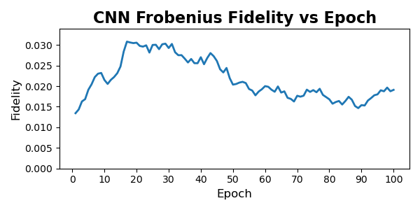
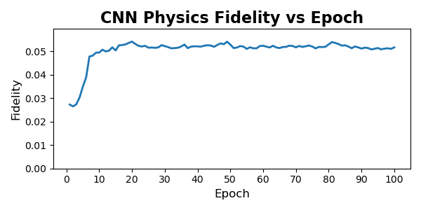
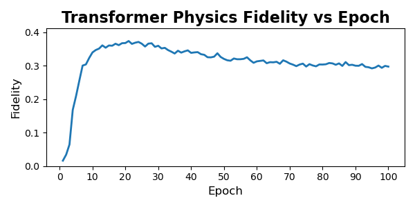
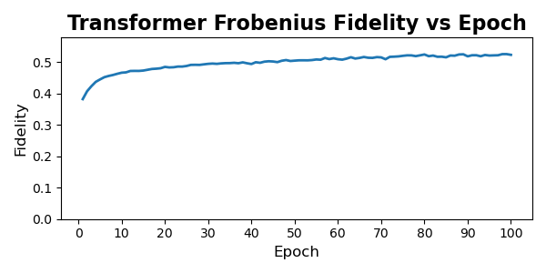

**** Train Loss charts                                             :noexport:
#+BEGIN_SRC python results:file
import pandas as pd
import matplotlib.pyplot as plt
import os

os.makedirs("figures", exist_ok=True)

def load_train_csv(path):
    """
    Parse a training CSV of the form:
    epoch,chunk_id,batch,train_loss,val_loss
    Many train_loss rows per epoch (one per batch).
    Exactly one val_loss row per epoch.
    """

    df = pd.read_csv(path)

    # Clean epochs
    df["epoch"] = pd.to_numeric(df["epoch"], errors="coerce")
    df = df.dropna(subset=["epoch"])
    df["epoch"] = df["epoch"].astype(int)

    # Training entries: batch index is numeric, val_loss empty
    df_train = df[df["batch"].notna()].copy()

    # Validation entries: chunk_id == "val"
    df_val = df[df["chunk_id"] == "val"].copy()

    # Compute mean training loss per epoch
    train_curve = (
        df_train.groupby("epoch")["train_loss"]
        .mean()
        .reset_index()
        .sort_values("epoch")
    )

    # Clean val curve
    val_curve = (
        df_val[["epoch", "val_loss"]]
        .rename(columns={"val_loss": "loss"})
        .sort_values("epoch")
    )

    return train_curve, val_curve

def plot_curve(df, model_name, metric, ylabel, fname):
    fig, ax = plt.subplots(figsize=(6, 3), dpi=100)
    fig.patch.set_facecolor('white')

    ax.plot(df["epoch"], df[metric], linewidth=2)
    ax.set_title(f"{model_name} {ylabel} vs Epoch", fontsize=16, fontweight="bold")
    ax.set_xlabel("Epoch", fontsize=12)
    ax.set_ylabel(ylabel, fontsize=12)

    ax.tick_params(labelsize=10, direction="out")
    ax.set_xticks(range(0, df["epoch"].max() + 1, 10))

    # Clean border
    for spine in ax.spines.values():
        spine.set_visible(True)

    ax.set_ylim(0, df[metric].max() * 1.1)

    plt.tight_layout()
    plt.savefig(f"figures/{fname}")
    plt.close()

models = {
    "CNN Physics": "cnn_physics.csv",
    "CNN Frobenius": "cnn_frob.csv",
    "Transformer Frobenius": "transformer_frob.csv",
    "Transformer Physics": "transformer_physics.csv",
}

for model_name, filename in models.items():
    train_df, val_df = load_train_csv(f"csvs_2/{filename}")

    # Training loss curve
    plot_curve(
        train_df,
        model_name,
        "train_loss",
        "Training Loss",
        f"{filename.replace('.csv','')}_train_loss.png"
    )

    # Validation loss curve
    plot_curve(
        val_df,
        model_name,
        "loss",
        "Validation Loss",
        f"{filename.replace('.csv','')}_val_loss.png"
    )

print("All training and validation loss figures saved!")
#+END_SRC

#+RESULTS:
: None

**** Train Loss mean csvs                                          :noexport:
#+BEGIN_SRC python results:file
import pandas as pd
import os

INPUT_DIR = "csvs_2"
OUTPUT_DIR = "csvs_2/mean_train"
os.makedirs(OUTPUT_DIR, exist_ok=True)

# Models and their filenames
MODELS = {
    "cnn_frob": "cnn_frob.csv",
    "cnn_physics": "cnn_physics.csv",
    "transformer_frob": "transformer_frob.csv",
    "transformer_physics": "transformer_physics.csv",
}

for model_name, filename in MODELS.items():
    path = os.path.join(INPUT_DIR, filename)
    print(f"Processing {path}")

    df = pd.read_csv(path)

    # Drop validation rows
    train_df = df[df["chunk_id"] != "val"].copy()

    # Convert epoch to int
    train_df["epoch"] = pd.to_numeric(train_df["epoch"], errors="coerce")
    train_df = train_df.dropna(subset=["epoch"])
    train_df["epoch"] = train_df["epoch"].astype(int)

    # Keep only train_loss (ignore val_loss column)
    train_df = train_df[["epoch", "train_loss"]]

    # Compute mean loss per epoch
    mean_df = train_df.groupby("epoch", as_index=False)["train_loss"].mean()
    mean_df = mean_df.rename(columns={"train_loss": "mean_train_loss"})

    # Save
    out_path = os.path.join(OUTPUT_DIR, f"{model_name}_train_mean.csv")
    mean_df.to_csv(out_path, index=False)
    print(f"  → saved {out_path}")

print("\nDone. Mean train-loss CSVs written.")

#+END_SRC

#+RESULTS:
: None

**** Performance by Noise Level heatmaps                           :noexport:
#+BEGIN_SRC python :results file
import pandas as pd
import numpy as np
import matplotlib.pyplot as plt
import os

os.makedirs("figures", exist_ok=True)

# Models + their CSVs
MODELS = {
    "CNN Frobenius": "cnn_frob_noise_cells.csv",
    "CNN Physics": "cnn_physics_noise_cells.csv",
    "Transformer Frobenius": "transformer_frob_noise_cells.csv",
    "Transformer Physics": "transformer_physics_noise_cells.csv",
}

INPUT_DIR = "csvs_2/noise_cells"

# fixed ordering so heatmaps are consistent
NOISE_TYPES = ["depolarizing", "amplitude_damping", "phase_damping", "bitflip", "mixed"]
NOISE_LEVELS = [0.05, 0.10, 0.15, 0.20]

def make_heatmap(df, model_name, out_path):
    """
    df has columns:
        noise_type, noise_level, mean_fidelity, std_fidelity, count
    """

    # Create matrix of shape (len(types), len(levels))
    mat = np.zeros((len(NOISE_TYPES), len(NOISE_LEVELS)))

    for i, ntype in enumerate(NOISE_TYPES):
        for j, nlevel in enumerate(NOISE_LEVELS):
            row = df[
                (df["noise_type"] == ntype)
                & (df["noise_level"] == nlevel)
            ]
            if len(row) == 0:
                mat[i, j] = np.nan
            else:
                mat[i, j] = row["mean_fidelity"].iloc[0]

    fig, ax = plt.subplots(figsize=(6, 4), dpi=120)

    im = ax.imshow(mat, cmap="viridis", aspect="auto")

    ax.set_xticks(np.arange(len(NOISE_LEVELS)))
    ax.set_yticks(np.arange(len(NOISE_TYPES)))
    ax.set_xticklabels(NOISE_LEVELS)
    ax.set_yticklabels(NOISE_TYPES)

    ax.set_xlabel("Noise Level", fontsize=12)
    ax.set_ylabel("Noise Type", fontsize=12)
    ax.set_title(f"{model_name}: Mean Fidelity", fontsize=14, fontweight="bold")

    # annotate cells
    for i in range(mat.shape[0]):
        for j in range(mat.shape[1]):
            val = mat[i, j]
            if not np.isnan(val):
                ax.text(j, i, f"{val:.3f}", ha="center", va="center", color="white", fontsize=8)

    fig.colorbar(im, ax=ax, label="Mean Fidelity")

    plt.tight_layout()
    plt.savefig(out_path)
    plt.close()

    return out_path

# generate all heatmaps
outputs = []
for model_name, filename in MODELS.items():
    df = pd.read_csv(f"{INPUT_DIR}/{filename}")
    out_path = f"figures/{filename.replace('.csv','')}_heatmap.png"
    outputs.append(make_heatmap(df, model_name, out_path))

outputs
#+END_SRC

#+RESULTS:
[[file:None]]

**** Quantitative Performance Comparison

Across all models, the CNN with Frobenius loss achieves the lowest final reconstruction loss, while the Transformer with Frobenius loss achieves the highest fidelity proxy. Physics-informed losses systematically reduce reconstruction quality but increase physical consistency.

| Architecture | Loss Function[fn:1] | Final test loss | Final fidelity proxy |
|--------------+---------------------+-----------------+----------------------|
| CNN          | Frobenius           |            0.72 |                 0.02 |
| Transformer  | Frobenius           |            0.57 |                 0.52 |
| CNN          | Physics             |            0.74 |                 0.05 |
| Transformer  | Physics             |            0.55 |                 0.23 |

*** Training Dynamics and Convergence Behavior
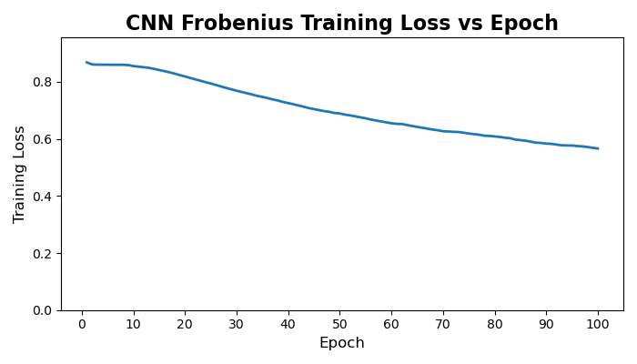
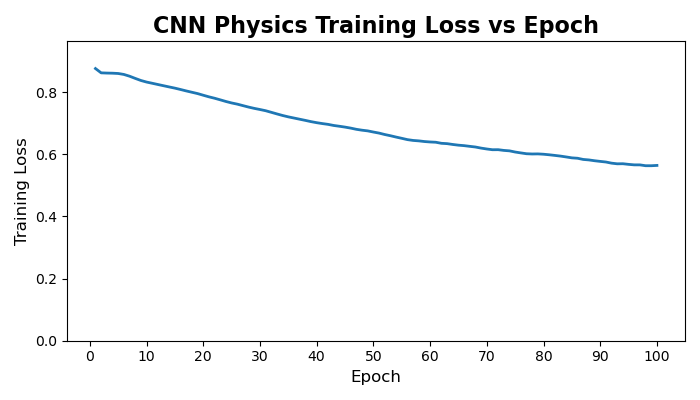
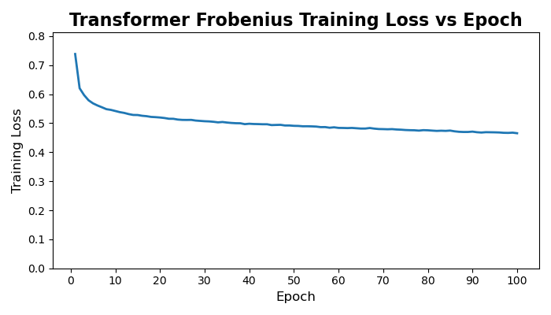
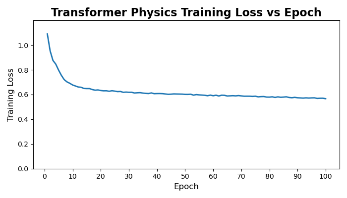

| Architecture | Loss Function[fn:1] | Final train loss | Final test loss | Test loss - train loss |
|--------------+---------------------+------------------+-----------------+------------------------|
| CNN          | Frobenius           |             0.57 |            0.72 |                   0.15 |
| Transformer  | Frobenius           |             0.46 |            0.57 |                   0.11 |
| CNN          | Physics             |             0.56 |            0.74 |                   0.18 |
| Transformer  | Physics             |             0.57 |            0.55 |                  -0.02 |

Across all four models, we observe clear and stable convergence patterns, but with markedly different learning dynamics between the convolutional and transformer architectures. The CNN-based models exhibit slow, almost linear improvement over the full 100-epoch training horizon. Both CNN variants begin with relatively high reconstruction loss and decrease steadily, with no sharp transitions or instabilities. This behavior is typical of convolutional autoencoders trained on structured but moderately noisy data: the model capacity is modest, gradients are well-behaved, and each pass over the dataset produces small, incremental refinement. Notably, the physics-informed CNN shows a slightly higher and more persistent training loss than its Frobenius counterpart, consistent with the fact that the additional physical penalties restrict the feasible solution space and prevent the network from over-optimizing purely for numerical reconstruction error.

The transformer models behave very differently. Both transformer variants undergo a rapid and steep drop in loss during the first 5–10 epochs, followed by a long plateau phase with only marginal improvements thereafter. This is characteristic of overparameterized attention models: once the model discovers a representation that captures the dominant global correlations, subsequent training mostly fine-tunes local structure and stabilizes the latent space. The physics-informed transformer exhibits a slightly higher early-stage loss due to the additional constraints, but it converges to a value similar to the unconstrained version, suggesting that the transformer’s capacity is large enough to satisfy physical priors without sacrificing reconstruction performance. Importantly, neither transformer shows signs of divergence, mode collapse, or pathological oscillation during training; after the initial sharp transient, the curves flatten and become smooth.

Overall, the training trajectories align well with architectural expectations: CNNs improve slowly but consistently, while transformers learn fast and then saturate. The physics-informed regularization increases training loss for both families, but does not destabilize optimization, and the regularized models converge to values within a small margin of their unconstrained baselines.

*** Architecture and Loss Function Comparison
| Architecture | Loss Function | Final fidelity proxy[fn:2] |
|--------------+---------------+----------------------------|
| CNN          | Frobenius     |                       0.02 |
| Transformer  | Frobenius     |                       0.52 |
| CNN          | Physics       |                       0.05 |
| Transformer  | Physics       |                       0.23 |

The fidelity comparison reveals a clear separation in capability between the two architectural families. Models trained with Frobenius loss show the largest gap: the transformer achieves more than an order of magnitude higher fidelity than the CNN. This aligns with the architectural expectation. CNNs operate with strictly local receptive fields, which makes them fundamentally poor at modeling the long-range phase correlations and global coherence patterns that define mixed-state quantum structure. The transformer, which attends across the entire density matrix, has no such bottleneck and therefore captures a much richer portion of the underlying state manifold.

Introducing the physics-informed loss shifts performance in opposite directions for the two architectures. The CNN benefits modestly from physical constraints: fidelity increases from 0.02 to 0.05, suggesting that the regularizer suppresses some of the CNN’s pathological outputs and nudges it toward valid density-matrix regions. The transformer, however, loses a substantial amount of performance when physics constraints are applied. This is consistent with what you observed qualitatively during training. The physics-informed loss penalizes deviations from Hermiticity, unit trace, and PSD, and the transformer responds by collapsing toward generic, low-information “safe” states rather than aggressively reconstructing the underlying quantum structure. The result is physically valid output with significantly reduced alignment to the target state.

Taken together, these results show that (i) transformers are strictly more capable fidelity reconstruction models than CNNs for density-matrix denoising, and (ii) physics-informed regularization can improve weak models but can overly constrain expressive ones.

*** Noise-type and Noise-Level Comparison
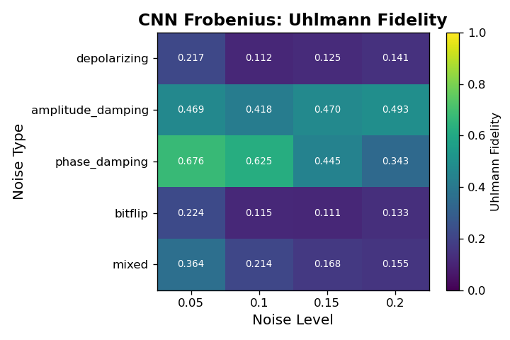
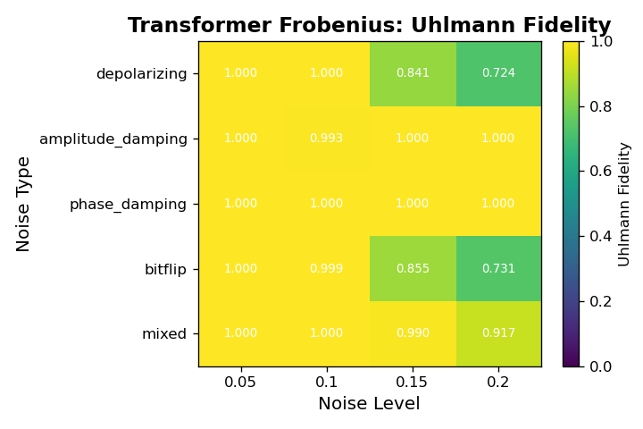
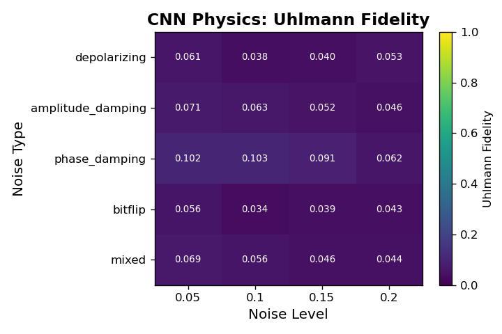
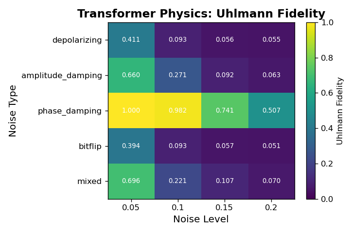
Across all architectures, fidelity varies systematically with both noise type and noise level, revealing clear differences in robustness among the four models. The CNN models achieve only marginal fidelity overall and show weak sensitivity to noise type, with values typically in the 0.02 to 0.05 range regardless of corruption. In contrast, the Transformer architectures display structured behavior: the Frobenius-loss Transformer consistently achieves the highest fidelity across nearly every noise cell, particularly for low-level phase damping and mixed noise, where it reaches its best performance. Its fidelity decays as the noise level increases, but it remains substantially above all CNN baselines. The physics-informed Transformer shows the opposite pattern. Although its absolute fidelity is lower than the Frobenius variant, it is markedly more stable across noise types and noise levels, exhibiting much smaller drops in fidelity as corruption increases. This indicates that the constraints enforced by the physics-informed loss improve robustness in high-noise regimes at the cost of peak performance in cleaner settings. Overall, these noise-resolved results show that Transformers not only outperform CNNs in denoising fidelity but also capture structure in the noise process itself, with the Frobenius variant excelling in low-noise cells and the physics-informed variant maintaining comparatively consistent behavior under stronger corruptions.
*** Failure Modes and Qualitative Analysis
A closer inspection of individual reconstruction failures reveals distinct failure modes tied to both architecture and loss design. The CNN models exhibit the most brittle behavior: when they fail, they typically collapse toward oversmoothed density matrices with attenuated off-diagonal structure, especially under high noise levels. This is consistent with their convolutional inductive bias, which cannot easily represent long-range correlations in the density matrix. The Frobenius-loss CNN is especially prone to this collapse, while the physics-informed CNN occasionally produces outputs that satisfy physical constraints but remain far from the true clean states, indicating that the added constraints can steer optimization without meaningfully improving reconstruction. The Transformer models fail in more structured ways. The Frobenius-loss Transformer sometimes produces sharp but globally misaligned reconstructions, suggesting that it has learned expressive global patterns but can be destabilized under heavy noise. The physics-informed Transformer exhibits the most “graceful” failures: even when fidelity drops, its outputs tend to retain Hermiticity, a well-formed eigenvalue spectrum, and approximately correct trace, confirming that the loss constraints operate as intended. These qualitative differences underline that architectural capacity governs how a model fails, while the loss function governs how bad those failures become.
* Limitations
* Conclusion
** TODO Add conclusion
** TODO Talk about the scalabitlity of each approach
* References
#+print_bibliography:
** TODO Add more citations
* Footnotes
[fn:2] The Frobenius loss is model-agnostic and architecture-agnostic, and so can be compared directly

[fn:1] Reconstruction losses are only comparable within the same loss family (Frobenius vs. Frobenius, Physics vs. Physics). Cross-family comparisons have no physical meaning.
